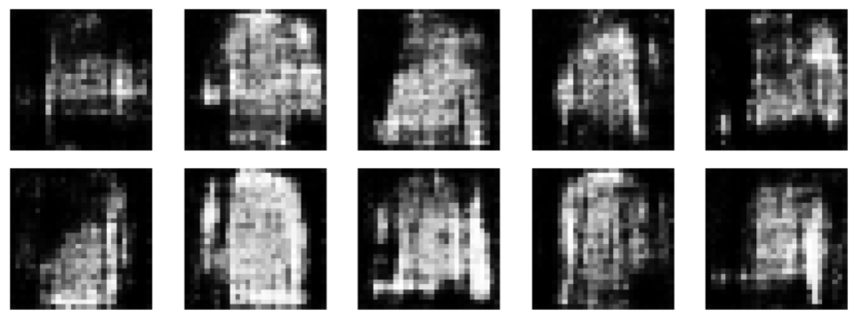
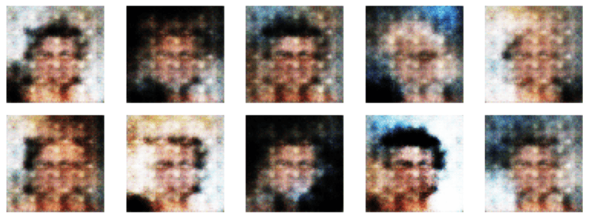

# 🎨 Generative Adversarial Networks (GANs): Classic and Deep Convolutional (DCGAN) Implementation

Repository is an implementation of Generative Adversarial Networks (GANs) and Deep Convolutional GAN (DCGAN)
- [Generative Adversarial Nets](https://arxiv.org/abs/1406.2661)
- [DCGAN Paper](https://arxiv.org/abs/1511.06434)

---

## Models
- **Classic GAN**: simple model with linear layers and activations. You can find generator and discriminator code in `gan.py` file with training loop in `gan_training.py`
- **DCGAN**: More advanced model with Conv2d and ConvTranspose2d layers. All results come from those architecture. Both FashionMnist and CelebA versions of models you can find in `dcgan.py` with training loop in `dcgan_training.py`

---
## Datasets
I decided to try my models on 2 datasets:
- **FashionMnist** - to have good starting point and practice training balancing [FashionMnist Dataset](https://www.kaggle.com/datasets/zalando-research/fashionmnist)
- **CelebA ** - to challange my models with more complex images like face images [CelebA Dataset](https://www.kaggle.com/datasets/jessicali9530/celeba-dataset)

To make training easier and faster I decided to use only male's photos 

---

##  Results and Visualizations

* **Goal:** To generate realistic images from noise using the DCGAN architecture.


### Fashion-MNIST Results
* **Generated Samples:** 
* **Training Progression (Fixed Noise):** 

### CelebA Results

* **Generated Samples:** 
* **Training Progression (Fixed Noise):** 


## Training Details
### Fashion-MNIST 
#### Preprocessing: 
I used transformed images using this code:

```python
transform = transforms.Compose([
    transforms.ToTensor(),
    transforms.Normalize((0.5,), (0.5,))
    ])
```
### Training parameters:
```python
batch_size = 256
k_steps = 1 # notation from GAN's paper - means number of discriminator steps in one epoch
n_epochs = 600
loss_fn = nn.BCELoss()
seed = 42
plot_freq = 5 # how often images are plotted during training (5 means every fifth epoch)

generator_optimizer = torch.optim.AdamW(generator.parameters(), lr=2e-5, betas = (0.5, 0.999))
discriminator_optimizer = torch.optim.AdamW(discriminator.parameters(), lr=2e-5, betas = (0.5, 0.999)) 
```

### CelebA 
#### Preprocessing: 
I used transformed images using this code. You can find this custom dataset class in `dataset.py` file:

```python
transform = transforms.Compose([
    transforms.Resize((64,64)),
    transforms.ToTensor(),
    transforms.Normalize((0.5,0.5,0.5), (0.5,0.5,0.5))
])

dataset = CelebADataset(root_dir = 'data/celeba/img_align_celeba', image_list = men_files_list, transform = transform)
```

`image_list` is required and you can filter images by any features (example for male's photos):
```python
attr_path = 'data/celeba/list_attr_celeba.txt'
df = pd.read_csv(attr_path, delim_whitespace=True, header=1)
men_df = df[df['Male'] == 1]
men_files_list = men_df.index.tolist()
```
### Training parameters:
```python
batch_size = 256
k_steps = 1 
n_epochs = 600
loss_fn = nn.BCELoss()
seed = 42
plot_freq = 10 

generator_optimizer = torch.optim.AdamW(generator.parameters(), lr=2e-5, betas = (0.5, 0.999))
discriminator_optimizer = torch.optim.AdamW(discriminator.parameters(), lr=1e-5, betas = (0.5, 0.999)) # lower lr to prevent discriminator domination 
```

# Ideas for improvement and experiments
- To experiment with smaller subsets of CelebA to make images more realistic
- To test with asymetric models architectures (stronger Generator)
- To test on other RGB Image Datasets
